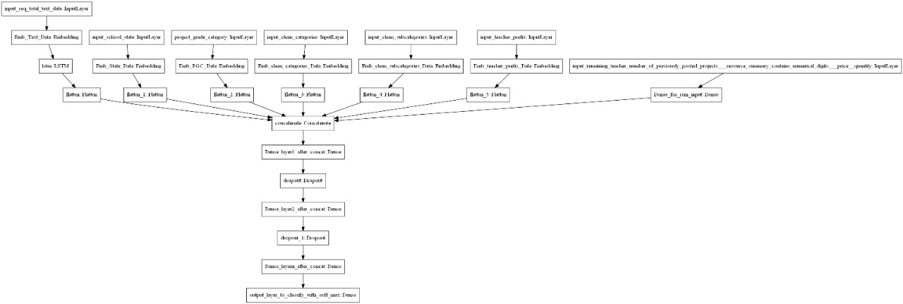

# LSTM_implementation_in_Donor_assignment

## Architecure of the Model

These are the columns of the dataset, We have preprocessed our dataset in the following ways to feed to the Network

You can download the dataets https://www.kaggle.com/donorschoose/io 

# Input_seq_total_text_data ---  Combine all the text data . After this use the Embedding layer to get word vectors. After this use LSTM and get the LSTM output and Flatten that output.

# Input_school_state ---- Give 'school_state' column as input to embedding layer and Train the Keras Embedding layer.

# Project_grade_category --- Give 'project_grade_category' column as input to embedding layer and Train the Keras Embedding layer.

# Input_clean_categories --- Give 'input_clean_categories' column as input to embedding layer and Train the Keras Embedding layer.

# Input_clean_subcategories --- Give 'input_clean_subcategories' column as input to embedding layer and Train the Keras Embedding layer.

# Input_clean_subcategories --- Give 'input_teacher_prefix' column as input to embedding layer and Train the Keras Embedding layer.

# Input_remaining_teacher_number_of_previously_posted_projects._resource_summary_contains_numerical_digits._price._quantity ---concatenate remaining columns and add a Dense layer after that.

